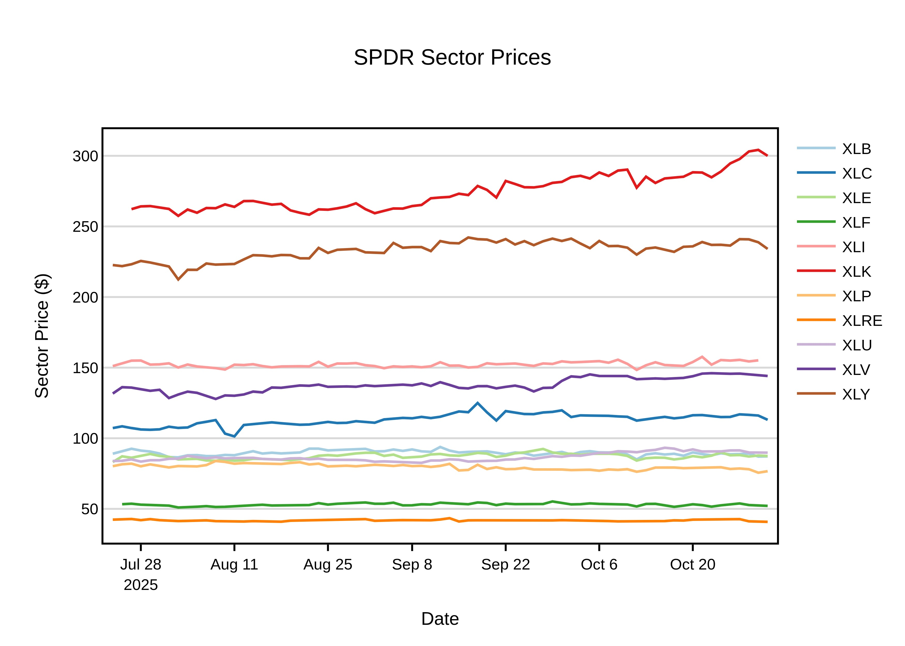
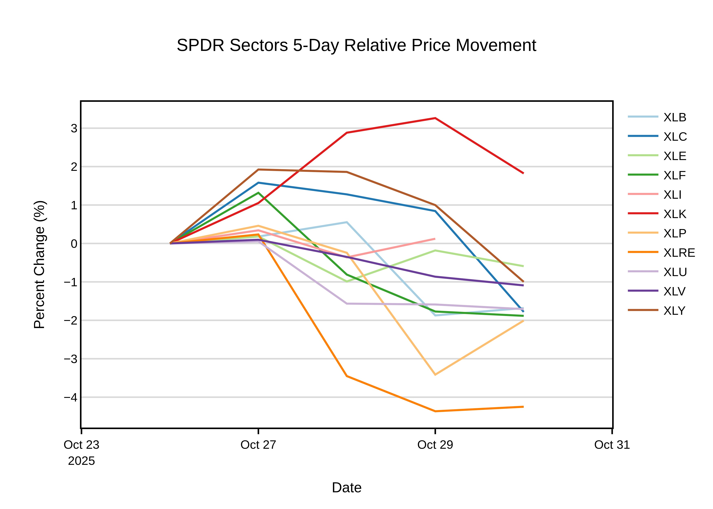

# SPDR Sector Data Pipeline (In Progress)
Developed a stock data pipeline in Python to gather stock price data from the YFinance API, web scrape SPDR sector data, and transform the data using Pandas and PostgreSQL to calculate each of the 11 SPDR ETF prices. Built and tested the workflow locally, and currently migrating to GitHub Actions and AWS S3 to automate the process.

